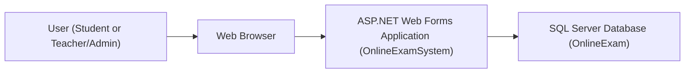
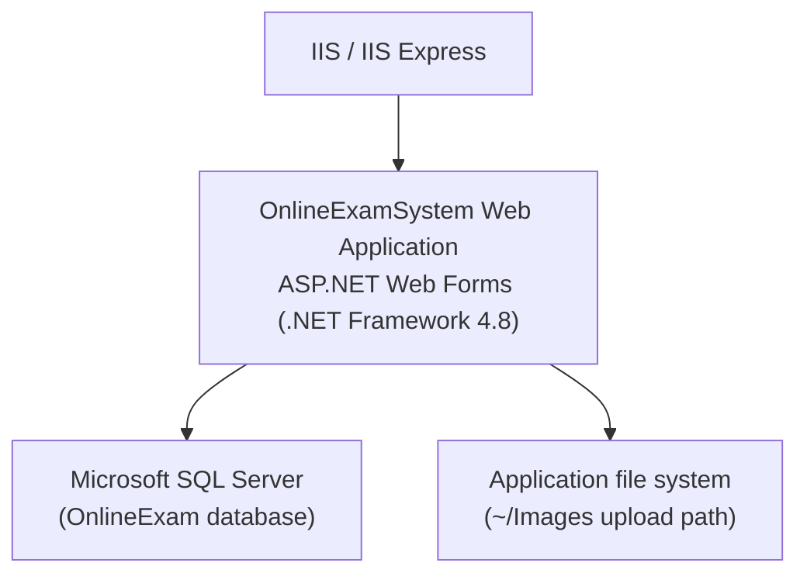
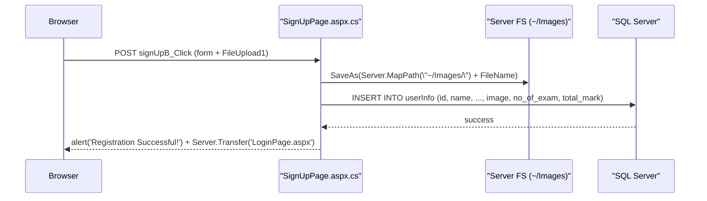
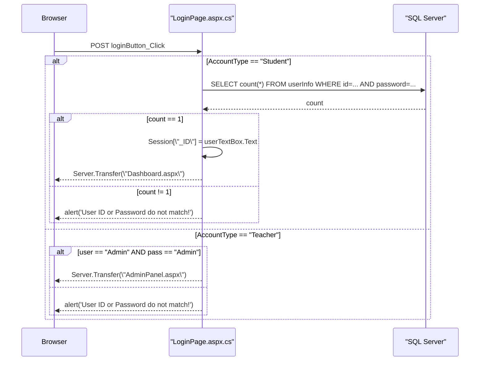
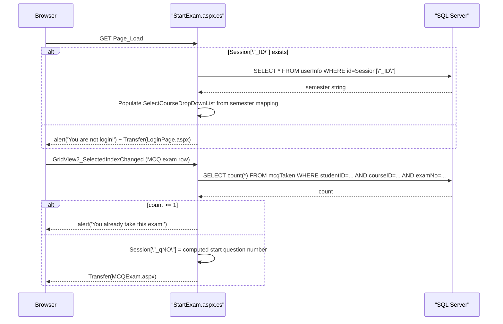
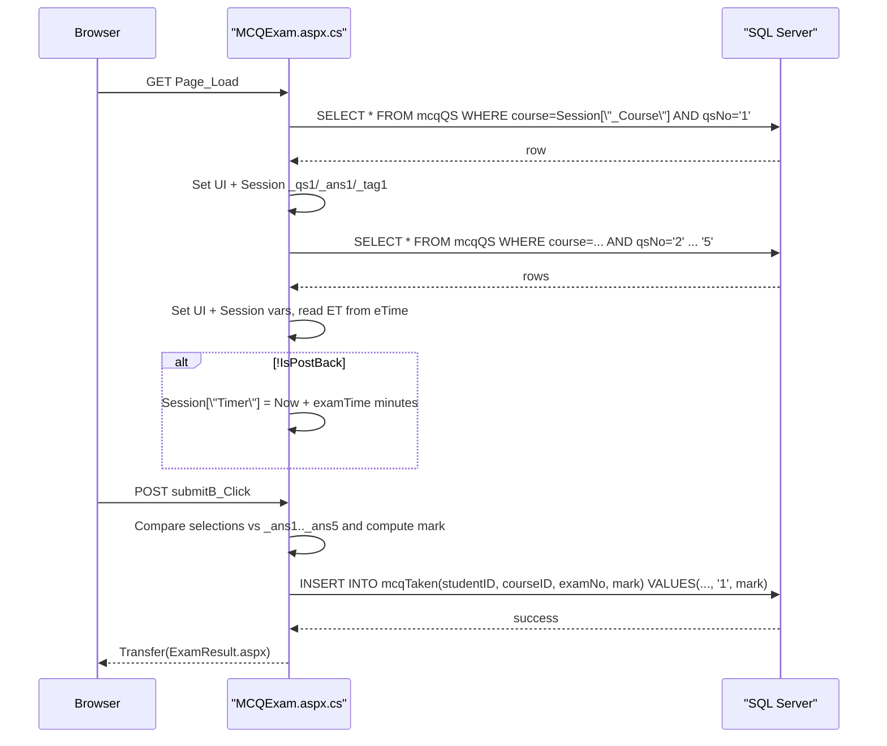
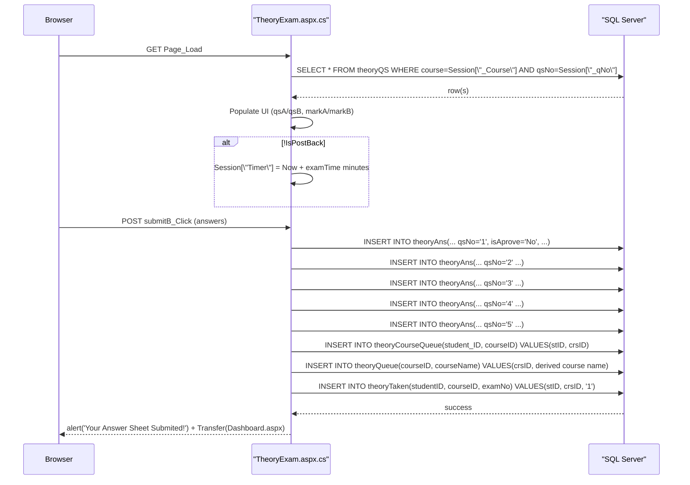
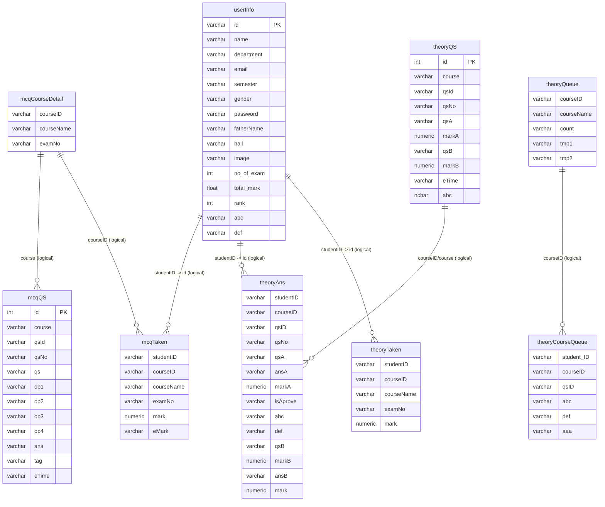

# Online Examination System (ASP.NET Web Forms) — Unified Codebase Documentation

## Scope and evidence rules

This document is derived strictly from the repository contents under `Online-Examination-System-7683/` and especially `Online-Examination-System-7683/OnlineExamSystem/`. Where the code uses placeholders (for example, connection strings set to `"your-database-connection-string"`), those are documented as-is and not assumed to be functional.

## High-level overview

The repository contains a monolithic ASP.NET Web Forms application targeting .NET Framework 4.8 (`TargetFrameworkVersion` is `v4.8`) that implements an online examination management system. The application is composed primarily of `.aspx` pages with C# code-behind files that interact directly with a SQL Server database via `System.Data.SqlClient`. The app supports two exam modes (MCQ and theory), a student registration and login flow, and an admin/teacher flow for setting questions and evaluating theory answer sheets. The repository also includes a SQL Server schema script under `database-script/`.

## Repository layout and module purposes

### Top-level repository (`Online-Examination-System-7683/`)

The top-level folder contains solution/project artifacts and documentation.

The important items are:

- `OnlineExamSystem.sln` is the Visual Studio solution file (not analyzed in detail here because the runtime behavior is primarily determined by the Web Forms project and configuration).
- `README.md` describes the project at a product level and includes screenshots.
- `database-script/Online-Examination-System-Databse-Script.sql` contains the SQL Server database creation and table definitions used by the application.
- `packages/` contains NuGet packages restored in a legacy packages folder layout.

### Web application project (`Online-Examination-System-7683/OnlineExamSystem/`)

This folder contains the ASP.NET Web Forms project. The key components are:

- `.aspx` pages: UI and server control markup (not included in the provided file reads), backed by `.aspx.cs` code-behind files.
- `.aspx.designer.cs` files: auto-generated control declarations for each page.
- `Web.config`: runtime configuration, including connection string placeholders and compilation settings.
- `OnlineExamSystem.csproj`: project definition including references, content items, and compile items.
- `CSS/bootstrap.css`: a Bootstrap-based stylesheet used for UI styling.
- `Images/`: user-uploaded images are saved under this directory by the sign-up flow (`SignUpPage.aspx.cs`).

#### Pages and their purpose (from code-behind)

The following page code-behind files were analyzed and inform the system behavior:

- `LoginPage.aspx.cs`: student login (DB check) and teacher login (hard-coded credential check).
- `SignUpPage.aspx.cs`: student registration and image upload to `~/Images/`.
- `Dashboard.aspx.cs`: student dashboard navigation to profile, leaderboard, and exam start.
- `StartExam.aspx.cs`: exam selection and routing to MCQ or theory exams; validates “already taken” state using `mcqTaken` and `theoryTaken`.
- `MCQExam.aspx.cs`: loads five MCQ questions from `mcqQS`, computes score, inserts into `mcqTaken`, and starts a timer via session state.
- `ExamResult.aspx.cs`: displays MCQ result, updates `userInfo.no_of_exam`, `userInfo.total_mark`, and `userInfo.abc` (average) and shows question text/answers/tags from session variables set during the MCQ exam.
- `TheoryExam.aspx.cs`: loads theory questions from `theoryQS`, inserts student answers into `theoryAns`, enqueues for admin evaluation via `theoryCourseQueue` and `theoryQueue`, inserts “taken” state into `theoryTaken`, and supports a session-based timer.
- `AdminCourseQueue.aspx.cs`: admin-side page that checks whether a course’s queue is empty and removes it from `theoryQueue` when empty; also routes to `ShowAns.aspx` upon selecting a grid row.
- `ShowAns.aspx.cs`: admin-side page that displays a student’s submitted theory answers (from `theoryAns`) and updates `theoryAns` to mark submission, also removing the item from `theoryCourseQueue`.
- `DownloadPdf.aspx.cs`: contains commented-out code referencing `iTextSharp` but no active PDF generation logic.

## Architecture

### System context diagram

The code shows a classic server-rendered Web Forms application accessed by browsers and backed by a SQL Server database. There are no additional services defined in the repository; database interactions are performed directly from page code-behind using `SqlConnection` and raw SQL strings.



### Container / runtime topology

The project is a single Web Forms application library (`OutputType` is `Library`) intended to run under IIS/IIS Express, with server-side sessions (`Session[...]`) used heavily across flows. The database is external (SQL Server).



### Component/module diagram (page-centric)

The application is page-oriented. The “components” are the Web Forms pages and the database tables they use.

```mermaid
flowchart TB
  subgraph StudentPages["Student-facing pages"]
    LP["LoginPage.aspx<br/>(LoginPage.aspx.cs)"]
    SU["SignUpPage.aspx<br/>(SignUpPage.aspx.cs)"]
    DBP["Dashboard.aspx<br/>(Dashboard.aspx.cs)"]
    ST["StartExam.aspx<br/>(StartExam.aspx.cs)"]
    MCQ["MCQExam.aspx<br/>(MCQExam.aspx.cs)"]
    TR["TheoryExam.aspx<br/>(TheoryExam.aspx.cs)"]
    ER["ExamResult.aspx<br/>(ExamResult.aspx.cs)"]
    LB["Leaderboard.aspx<br/>(Leaderboard.aspx.cs)"]
    UP["UserProfile.aspx<br/>(UserProfile.aspx.cs)"]
  end

  subgraph AdminPages["Teacher/Admin-facing pages"]
    ACQ["AdminCourseQueue.aspx<br/>(AdminCourseQueue.aspx.cs)"]
    SA["ShowAns.aspx<br/>(ShowAns.aspx.cs)"]
  end

  subgraph DBTables["SQL Server tables (from SQL script and code usage)"]
    T_userInfo["userInfo"]
    T_mcqQS["mcqQS"]
    T_mcqTaken["mcqTaken"]
    T_mcqCourseDetail["mcqCourseDetail"]
    T_theoryQS["theoryQS"]
    T_theoryAns["theoryAns"]
    T_theoryTaken["theoryTaken"]
    T_theoryCourseDetail["theoryCourseDetail"]
    T_theoryCourseQueue["theoryCourseQueue"]
    T_theoryQueue["theoryQueue"]
  end

  LP --> T_userInfo
  SU --> T_userInfo
  UP --> T_userInfo

  ST --> T_mcqQS
  ST --> T_theoryQS
  ST --> T_mcqTaken
  ST --> T_theoryTaken

  MCQ --> T_mcqQS
  MCQ --> T_mcqTaken
  ER --> T_userInfo

  TR --> T_theoryQS
  TR --> T_theoryAns
  TR --> T_theoryCourseQueue
  TR --> T_theoryQueue
  TR --> T_theoryTaken

  ACQ --> T_theoryCourseQueue
  ACQ --> T_theoryQueue
  SA --> T_theoryAns
  SA --> T_theoryCourseQueue
```



## Execution flow and interaction diagrams

### Student registration (SignUpPage)

`SignUpPage.aspx.cs` accepts fields (ID, name, department, email, semester, gender, password, father name, hall) and saves an uploaded file to `~/Images/`, then inserts a row into `userInfo`. It initializes `no_of_exam` to `0` and `total_mark` to `0`.



#### Code snippet: upload and insert

From `SignUpPage.aspx.cs`, the upload destination and DB insert are hard-coded to `"your-database-connection-string"` in this file.

```csharp
FileUpload1.SaveAs(Server.MapPath("~/Images/") + Path.GetFileName(FileUpload1.FileName));
string link = "Images/" + Path.GetFileName(FileUpload1.FileName);

string CS = "your-database-connection-string";
SqlConnection con = new SqlConnection(CS);
con.Open();
string newcon = "insert into userInfo (id,name,department,email,semester,gender,password,fatherName,hall,image,no_of_exam,total_mark) " +
                "VALUES('" + idTxBox.Text + "', '" + nameTxBox.Text + "', '" + deptDropDownList.Text + "', '" + emailTxBox.Text + 
                "', '" + semesterDropDownList.Text + "', '" + genderDropDownList.Text + "', '" + passTxBox.Text + 
                "', '" + fatherNameTB.Text + "', '" + hallTB.Text + "', '" + link + "', '" + nEx + "', '" + tM + "')";
```

### Student login (LoginPage)

`LoginPage.aspx.cs` supports two account types based on a dropdown `AccountTypeDB`:

- If `Student`, it queries `userInfo` using `SELECT count(*)` with `id` and `password` string concatenation, and sets `Session["_ID"]` when it matches.
- If `Teacher`, it checks for hard-coded credentials `Admin` / `Admin` and routes to `AdminPanel.aspx`.



#### Code snippet: student authentication query

From `LoginPage.aspx.cs`:

```csharp
SqlCommand cmd = new SqlCommand(
  "select count(*) from userInfo where id ='" + userTextBox.Text + "' and password='" + passTextBox.Text + "' ",
  con
);
```

## Exam flows

### StartExam: selecting course and checking “already taken” status

`StartExam.aspx.cs` uses `Session["_ID"]` to determine whether the user is logged in. It then loads the logged-in user’s semester from `userInfo` and populates the course dropdown with a fixed set of course IDs based on that semester string.

The file also handles selecting an existing exam (via grid selection) and routes to either `TheoryExam.aspx` or `MCQExam.aspx` while checking `theoryTaken` / `mcqTaken` to prevent retakes.



### MCQ exam execution and scoring

`MCQExam.aspx.cs` loads five questions from `mcqQS` using `qsNo` values `"1"` through `"5"` for the currently selected `Session["_Course"]`. It stores question text, correct answer, and tag into session variables `_qs1.._qs5`, `_ans1.._ans5`, `_tag1.._tag5`.

On submit, it checks whether each `RadioButtonList` selection matches the correct answer text and computes `mark`. It inserts a row into `mcqTaken` with `examNo` set to `"1"`.

It also implements a timer using `Session["Timer"]` set to `DateTime.Now.AddMinutes(examTime)` where `examTime` is parsed from the `eTime` column of the fifth question row (because `ET` is assigned only when reading `qsNo='5'`).



#### Code snippet: insert into `mcqTaken`

From `MCQExam.aspx.cs`:

```csharp
string newcon = "insert into mcqTaken (studentID,courseID,examNo,mark) VALUES('" + sNo + "','" + crsNo + "', '" + "1" + "', '" + M + "')";
SqlCommand cmd = new SqlCommand(newcon, con);
cmd.ExecuteNonQuery();
```

### ExamResult: updating user aggregate stats

`ExamResult.aspx.cs` reads the current MCQ mark from `Session["_tMark"]`, fetches the current `no_of_exam` and `total_mark` from `userInfo`, increments them, and updates `userInfo.abc` with the computed average.

It also fills labels on the page with question text, tags, and answers from session variables set by the MCQ exam page.

```mermaid
sequenceDiagram
  participant Browser
  participant Result as "ExamResult.aspx.cs"
  participant DB as "SQL Server"

  Browser->>Result: GET Page_Load
  Result->>Result: markLabel = Session[\"_tMark\"]
  Result->>DB: SELECT * FROM userInfo WHERE id=Session[\"_ID\"]
  DB-->>Result: no_of_exam, total_mark
  Result->>Result: totalMark = total_mark + _tMark; noOfExam = no_of_exam + 1; Avg = totalMark/noOfExam
  Result->>DB: UPDATE userInfo SET no_of_exam=..., total_mark=..., abc=Avg WHERE id=...
  DB-->>Result: success
  Result->>Result: Render question/answer details from Session variables
```

### Theory exam submission and admin evaluation queue

`TheoryExam.aspx.cs` loads theory questions from `theoryQS` using a session-based starting question number `Session["_qNo"]` (note: the file uses `Session["_qNo"]` but `StartExam.aspx.cs` sets `Session["_qNO"]` with different casing; this is documented as observed, without assuming intent).

On submit, it inserts five rows into `theoryAns` for `qsNo` `"1"` through `"5"` (the `qsNo` inserted is not derived from `Session["_qNo"]`), each with `isAprove='No'`. It then inserts into `theoryCourseQueue` and `theoryQueue` to represent work for admin evaluation, and inserts a row into `theoryTaken` with `examNo='1'`.



### Admin queue and marking

`AdminCourseQueue.aspx.cs` (class name `AdminQueue`) performs a check: if `Session["_checkCID"]` exists it counts rows in `theoryCourseQueue` for that course and deletes the `theoryQueue` row if `theoryCourseQueue` is empty for that course.

The admin marks a specific student+course by selecting a row in a `GridView`, which sets `Session["_stID"]` and `Session["_crsID"]` and transfers to `ShowAns.aspx`.

`ShowAns.aspx.cs` loads theory answers for five question numbers (1..5) from `theoryAns`, and on submit, attempts to compute totals from entered mark fields and performs:

- `update theoryAns set mark='total', isAprove='Yes' where studentID=... and courseID=...`
- `delete from theoryCourseQueue where student_ID=... and courseID=...`

The file contains commented-out logic for updating `theoryQueue` counts; the active logic uses a delete in `AdminCourseQueue.aspx.cs` based on queue emptiness.

```mermaid
sequenceDiagram
  participant Browser
  participant AdminQ as "AdminCourseQueue.aspx.cs"
  participant Show as "ShowAns.aspx.cs"
  participant DB as "SQL Server"

  Browser->>AdminQ: GET Page_Load
  alt Session[\"_checkCID\"] exists
    AdminQ->>DB: SELECT count(*) FROM theoryCourseQueue WHERE courseID=Session[\"_checkCID\"]
    DB-->>AdminQ: count
    alt count == 0
      AdminQ->>DB: DELETE FROM theoryQueue WHERE courseID=...
      DB-->>AdminQ: success
    end
  end

  Browser->>AdminQ: GridView1_SelectedIndexChanged
  AdminQ->>AdminQ: Session[\"_stID\"] = row.Cells[1]; Session[\"_crsID\"] = row.Cells[2]
  AdminQ-->>Browser: Transfer(ShowAns.aspx)

  Browser->>Show: GET Page_Load
  Show->>DB: SELECT * FROM theoryAns WHERE studentID=_stID AND courseID=_crsID AND qsNo='1'..'5'
  DB-->>Show: rows
  Show->>Show: Populate UI with questions, expected marks, answers

  Browser->>Show: POST submitB_Click (marks)
  Show->>DB: UPDATE theoryAns SET mark=total, isAprove='Yes' WHERE studentID=_stID AND courseID=_crsID
  Show->>DB: DELETE FROM theoryCourseQueue WHERE student_ID=_stID AND courseID=_crsID
  Show-->>Browser: alert('Mark Submitted!') + Transfer(AdminCourseQueue.aspx)
```

## Database schema and data model

### Source of truth

The SQL schema is defined in `database-script/Online-Examination-System-Databse-Script.sql`. The application code references tables by name directly in SQL strings, so the table names and key columns are inferred from both the script and the code.

### Tables (from SQL script excerpts)

The script defines at least the following tables (matching those used in the code):

- `userInfo`: stores student identity and aggregate exam stats.
- `mcqQS`: stores MCQ questions, options, answers, tags, and an `eTime` value.
- `mcqCourseDetail`: stores course-level MCQ exam instances (courseID, courseName, examNo).
- `mcqTaken`: stores an MCQ exam attempt (studentID, courseID, examNo, mark, etc.).
- `theoryQS`: stores theory questions including A/B parts and marks and an `eTime` value.
- `theoryCourseDetail`: stores course-level theory exam instances.
- `theoryAns`: stores submitted theory answers per student and course and question number plus approval and marking fields.
- `theoryCourseQueue`: stores pending marking items per student and course.
- `theoryQueue`: stores a course-level queue used by admin/teacher.
- `theoryTaken`: stores that a theory exam was taken.

### ER diagram (logical relationships)

The script does not define foreign keys in the shown excerpts, but columns suggest logical relationships (for example, `theoryAns.studentID` ties to `userInfo.id`, and `mcqTaken.studentID` ties to `userInfo.id`). These links are represented as logical relations rather than enforced constraints.



## Configuration, environment, and dependencies

### .NET Framework and MSBuild project configuration

`OnlineExamSystem.csproj` shows:

- `.NET Framework 4.8` target (`<TargetFrameworkVersion>v4.8</TargetFrameworkVersion>`).
- `OutputType` is `Library`, typical for Web Application projects.
- Uses IIS Express in development (`<UseIISExpress>true</UseIISExpress>`).
- Web Forms project type GUIDs include `{349c5851-65df-11da-9384-00065b846f21}` indicating a web application.

### Web.config

`OnlineExamSystem/Web.config` includes:

- Compilation debug enabled and target framework `4.8`:

```xml
<system.web>
  <compilation debug="true" targetFramework="4.8"/>
  <httpRuntime targetFramework="4.5.2"/>
</system.web>
```

- CodeDOM compiler providers configured for Roslyn via `Microsoft.CodeDom.Providers.DotNetCompilerPlatform`.

- Connection strings are placeholders:

```xml
<connectionStrings>
  <add name="dbconnection" connectionString="your-database-connection-string"/>
  <add name="OnlineExamConnectionString" connectionString="your-database-connection-string" providerName="System.Data.SqlClient"/>
</connectionStrings>
```

In the analyzed code-behind files, many DB connections do not read from `Web.config` and instead set `string CS = "your-database-connection-string";` directly in code. One exception is `UserProfile.aspx.cs`, which includes a concrete local SQL Express connection string literal.

### Web.Debug.config and Web.Release.config

The transformation files exist but contain only template comments and, for Release, remove the debug attribute in compilation:

```xml
<compilation xdt:Transform="RemoveAttributes(debug)" />
```

### NuGet and third-party dependencies

`packages.config` lists:

- `Microsoft.CodeDom.Providers.DotNetCompilerPlatform` version `1.0.0`
- `Microsoft.Net.Compilers` version `1.0.0` (development dependency)

`OnlineExamSystem.csproj` also references:

- `CrystalDecisions.Web, Version=13.0.4000.0` (a Crystal Reports-related assembly reference is present in the project file, but no usage was identified in the analyzed code-behind files).
- Standard .NET assemblies: `System.Web`, `System.Data`, `System.Configuration`, etc.

`DownloadPdf.aspx.cs` contains commented-out references to `iTextSharp` namespaces and types, but since they are commented out, they are not active dependencies from the code as it exists.

## Build, run, and deployment workflows (as present in repo)

### Build

The project is a Visual Studio Web Application project (`OnlineExamSystem.csproj`) and expects NuGet packages to exist under `../packages/`. The csproj includes an `EnsureNuGetPackageBuildImports` target that fails the build if the Roslyn packages are missing.

Relevant excerpt from the csproj:

```xml
<Error Condition="!Exists('..\\packages\\Microsoft.Net.Compilers.1.0.0\\build\\Microsoft.Net.Compilers.props')" ... />
<Error Condition="!Exists('..\\packages\\Microsoft.CodeDom.Providers.DotNetCompilerPlatform.1.0.0\\build\\Microsoft.CodeDom.Providers.DotNetCompilerPlatform.props')" ... />
```

### Run

The project is configured for IIS/IIS Express via Visual Studio properties inside the `.csproj` `ProjectExtensions`. There is no repository-provided script for launching; it is intended to run as a Web Forms app hosted by IIS.

### Database setup

The repository includes a SQL script `database-script/Online-Examination-System-Databse-Script.sql` that creates a database named `OnlineExam` and creates tables such as `userInfo`, `mcqQS`, `theoryQS`, and queue/taken tables. The code frequently uses a placeholder connection string; to run the app, the placeholder must be replaced either in `Web.config` and/or in code where string literals are used.

## Error handling, logging, and telemetry

### Error handling approach

The analyzed code-behind files primarily use:

- `try/catch` blocks that call `Response.Write("<script>alert(ex.Message);</script>");` (example: student login).
- In some places, exceptions are caught but ignored (example: SignUpPage and MCQSet have empty catch bodies with commented-out diagnostics).

There is no structured logging framework or telemetry library usage shown in the analyzed files. There is no `log4net`, `Serilog`, Application Insights, or similar instrumentation referenced in the code excerpts provided.

### Client-visible error reporting

Errors are communicated to the client primarily via JavaScript alert dialogs rendered with `Response.Write("<script>alert('...');</script>");`.

## Security-relevant mechanisms and observations (strictly from code)

### Authentication and session state

- Student authentication uses a SQL query against `userInfo` and then stores the logged-in ID in `Session["_ID"]`.
- Teacher/admin authentication is implemented as a hard-coded check: username `"Admin"` and password `"Admin"`.

Session variables are used broadly to pass security-relevant identity state and flow state:

- `Session["_ID"]`: logged-in student ID.
- `Session["_Course"]`: selected course for an exam.
- `Session["_tMark"]`: computed MCQ mark.
- `Session["_stID"]` and `Session["_crsID"]`: used by admin pages to identify which answer sheet to grade.

### SQL query construction

Many database queries are built via string concatenation using values from server controls. For example in `LoginPage.aspx.cs`:

```csharp
"select count(*) from userInfo where id ='" + userTextBox.Text + "' and password='" + passTextBox.Text + "' "
```

The same pattern appears in insert statements in `SignUpPage.aspx.cs`, `MCQExam.aspx.cs`, `TheoryExam.aspx.cs`, and marking flows (`ShowAns.aspx.cs`). This is an implementation detail observed directly from the code.

### Credential and secret handling

- `Web.config` contains placeholder connection strings (`"your-database-connection-string"`).
- Many code-behind files also hard-code `"your-database-connection-string"` directly.
- `UserProfile.aspx.cs` includes an explicit SQL Server connection string with `User ID=sa;Password=...` hard-coded in source. This is a literal present in the repository and used by that page to query `userInfo`.

## Notable implementation details and quirks (observed)

### Session key casing mismatch in theory exam flow

- `StartExam.aspx.cs` sets `Session["_qNO"]` (uppercase `O`) when starting an exam from either GridView.
- `TheoryExam.aspx.cs` reads `int qN = (int)Session["_qNo"];` (lowercase `o`) and then uses it to fetch questions.

This mismatch is present in the repository as-is.

### Timer behavior

Both exam pages implement timers using a session value named `Session["Timer"]` set to a time in the future and updated via `Timer1_Tick`. If time is expired, the label shows `"Time Out!"` but no forced submission is executed in the current code (the MCQ page includes commented-out code suggesting an intent to auto-submit).

### Exam number handling

Several inserts use a hard-coded exam number `"1"`:

- `MCQExam.aspx.cs` inserts `examNo = '1'` into `mcqTaken`.
- `TheoryExam.aspx.cs` inserts `examNo = '1'` into `theoryTaken` and inserts `qsNo` values `"1"` through `"5"` into `theoryAns`.

## Appendix: Key files referenced

### Project definition and config

- `Online-Examination-System-7683/OnlineExamSystem/OnlineExamSystem.csproj`
- `Online-Examination-System-7683/OnlineExamSystem/Web.config`
- `Online-Examination-System-7683/OnlineExamSystem/Web.Debug.config`
- `Online-Examination-System-7683/OnlineExamSystem/Web.Release.config`
- `Online-Examination-System-7683/OnlineExamSystem/packages.config`

### Database schema

- `Online-Examination-System-7683/database-script/Online-Examination-System-Databse-Script.sql`

### Core flows (code-behind)

- `Online-Examination-System-7683/OnlineExamSystem/LoginPage.aspx.cs`
- `Online-Examination-System-7683/OnlineExamSystem/SignUpPage.aspx.cs`
- `Online-Examination-System-7683/OnlineExamSystem/Dashboard.aspx.cs`
- `Online-Examination-System-7683/OnlineExamSystem/StartExam.aspx.cs`
- `Online-Examination-System-7683/OnlineExamSystem/MCQExam.aspx.cs`
- `Online-Examination-System-7683/OnlineExamSystem/ExamResult.aspx.cs`
- `Online-Examination-System-7683/OnlineExamSystem/TheoryExam.aspx.cs`
- `Online-Examination-System-7683/OnlineExamSystem/AdminCourseQueue.aspx.cs`
- `Online-Examination-System-7683/OnlineExamSystem/ShowAns.aspx.cs`
- `Online-Examination-System-7683/OnlineExamSystem/UserProfile.aspx.cs`
- `Online-Examination-System-7683/OnlineExamSystem/MCQSet.aspx.cs`
- `Online-Examination-System-7683/OnlineExamSystem/TheorySet.aspx.cs`
- `Online-Examination-System-7683/OnlineExamSystem/DownloadPdf.aspx.cs`
